# AI Civic Issue Reporter

> An AI-powered platform for reporting, analyzing, and managing civic infrastructure issues — with end-to-end cryptographic security.

---

## Table of Contents

- [Overview](#overview)
- [Features](#features)
- [Security Architecture](#security-architecture)
- [Image Encryption Pipeline](#image-encryption-pipeline)
- [Project Structure](#project-structure)
- [Setup & Installation](#setup--installation)
- [Running the Application](#running-the-application)
- [Demo & Diagnostics](#demo--diagnostics)
- [Tech Stack](#tech-stack)

---

## Overview

The **AI Civic Issue Reporter** allows citizens to photograph and report local civic problems (potholes, broken streetlights, flooding, etc.). Uploaded images are analyzed by an AI service and stored with **military-grade encryption**, ensuring privacy and data integrity from submission to storage.

---

## Features

| Feature | Description |
|---|---|
| Image Upload | Submit photos of civic issues via a Gradio web interface |
| AI Analysis | Automatic issue detection and classification using AI |
| Encrypted Storage | All images encrypted at rest with AES-256 |
| Secure Auth | Admin authentication with hashed passwords |
| Database Logging | All reports tracked in a structured SQL database |
| Web Interface | Clean, accessible Gradio UI for citizens and admins |

---

## Security Architecture

### Cryptographic Layers

```
┌─────────────────────────────────────────────────────────┐
│                   SECURITY STACK                        │
├─────────────────────────────────────────────────────────┤
│  Layer 1 │ AES-256 Image Encryption (at-rest)           │
│  Layer 2 │ Secure Key Management (Binary Key Files)     │
│  Layer 3 │ Password Hashing (Admin Auth)                │
│  Layer 4 │ Plaintext Scrubbing (Delete after encrypt)   │
└─────────────────────────────────────────────────────────┘
```

### Key Management

- AES encryption keys are stored as **binary `.bin` files** in the `keys/` directory
- Keys are **never stored in plaintext** or committed to version control
- Key material can be inspected in hexadecimal for auditing:

```bash
python -c "f=open('keys/aes_image_key.bin','rb'); print(f.read().hex())"
```

### Password Security

Admin passwords are **never stored in plaintext**. The `password_utils` module handles:

- Secure password hashing
- Hash verification on login
- Salt generation to prevent rainbow table attacks

Run the password utilities demo:

```bash
python -m app.password_utils
```

### Plaintext Scrubbing

After every image upload, the **plaintext file is immediately deleted** once encryption is confirmed. Only the `.enc` file persists on disk. This ensures:

- No unencrypted images remain after processing
- Temporary files are not recoverable by unauthorized parties

---

## Image Encryption Pipeline

```mermaid
flowchart LR

A[User uploads image] --> B[Gradio saves file to temp directory]
B --> C[Copy file to uploads/photo.jpg\n⚠️ Temporary plaintext]
C --> D[Run encrypt_image]
D --> E[Create encrypted file\nuploads/photo.jpg.enc]
E --> F[Delete plaintext file\nuploads/photo.jpg]
F --> G[Only encrypted file remains\nuploads/photo.jpg.enc ✅]

classDef user fill:#e3f2fd,stroke:#1e88e5,stroke-width:2px
classDef process fill:#e8f5e9,stroke:#43a047,stroke-width:2px
classDef warning fill:#fff3e0,stroke:#fb8c00,stroke-width:2px
classDef secure fill:#e8eaf6,stroke:#5e35b1,stroke-width:2px

class A user
class B,D,E,F process
class C warning
class G secure
```



### Encryption Steps

1. **Upload** — User submits image via the Gradio interface
2. **Temp Save** — Gradio writes the file temporarily to disk as plaintext
3. **Encrypt** — `encrypt_image()` applies AES-256 encryption using the binary key
4. **Persist** — Encrypted `.enc` file is saved to `uploads/`
5. **Scrub** — Original plaintext image is securely deleted
6. **Done** — Only the encrypted file remains; no sensitive data at rest

---

## Project Structure

```
AI_CIVIC_ISSUE_REPORTER/
│
├── app/
│   ├── uploads/              ← Encrypted image files (.enc)
│   ├── ai_service.py         ← AI issue detection & classification
│   ├── auth.py               ← Admin authentication logic
│   ├── db_utils.py           ← Database helper functions
│   ├── gradio_app.py         ← Main Gradio web interface
│   ├── admin_signature.py    ← Crypto interface
│   ├── complaint_hash.py     ← Custom Built crypto hash interface
│   ├── jwt_tokens.py         ← JWT Tokens interface
│   ├── security_audit.py     ← Audit Logs interface
│   ├── image_processor.py    ← Image handling & preprocessing
│   ├── image_encryption.py   ← AES-256 encryption/decryption
│   ├── password_utils.py     ← Password hashing & verification
│   └── init_db.py            ← Database initialization
│
├── keys/
│   └── aes_image_key.bin     ← AES encryption key (binary, gitignored)
│
├── sql/
│   └── init_schema.sql       ← Database schema definition
│
├── tests/                    ← Test suite
├── venv/                     ← Python virtual environment
├── .env                      ← Environment variables (gitignored)
├── requirements.txt          ← Python dependencies
├── set_admin_password.py     ← Admin password configuration tool
└── README.md
```

> **Security Note:** Never commit `keys/`, `.env`, or any `.bin` files to version control. Add them to `.gitignore`.

---

## Setup & Installation

> Complete the following steps **in order** for a fresh install:

### Step 1 — Create Virtual Environment

```bash
python -m venv venv
```

### Step 2 — Activate Virtual Environment

```bash
# Windows
venv\Scripts\activate

# macOS / Linux
source venv/bin/activate
```

### Step 3 — Install Dependencies

```bash
pip install -r requirements.txt
```

### Step 4 — Initialize the Database

```bash
python app/init_db.py
```

### Step 5 — Set Admin Password

```bash
python set_admin_password.py
```

> This hashes and stores your admin password securely. Do not skip this step.

### Step 6 — Launch the Application

```bash
python -m app.gradio_app
```

---

## Running the Application

After setup is complete, start the app with:

```bash
python -m app.gradio_app
```

The Gradio interface will be available at `http://localhost:7860` by default.

---

## Demo & Diagnostics

### Run Encryption Demo

Test the full image encryption pipeline interactively:

```bash
python -m app.image_encryption
```

### Run Password Utilities Demo

Test password hashing and verification:

```bash
python -m app.password_utils
```

### Inspect AES Key (Hex)

View the raw encryption key in hexadecimal format for auditing:

```bash
python -c "f=open('keys/aes_image_key.bin','rb'); print(f.read().hex())"
```

---

## Tech Stack

| Component | Technology |
|---|---|
| Web Interface | [Gradio](https://gradio.app/) |
| AI Service | Python AI/ML (configured via `.env`) |
| Encryption | AES-256 (PyCryptodome / cryptography) |
| Password Hashing | bcrypt / hashlib |
| Database | SQLite (via `init_schema.sql`) |
| Language | Python 3.x |

---

## Security Checklist

- [x] Images encrypted at rest with AES-256
- [x] Plaintext images deleted immediately after encryption
- [x] Admin passwords hashed (never stored in plaintext)
- [x] Encryption keys stored as binary files (not in source code)
- [x] `.env` excluded from version control
- [x] `keys/` directory excluded from version control

---

*Built with security-first principles for transparent civic engagement.*